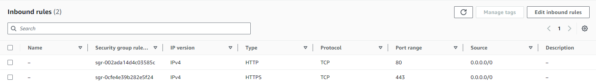
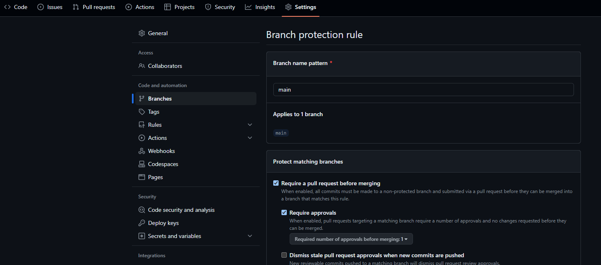
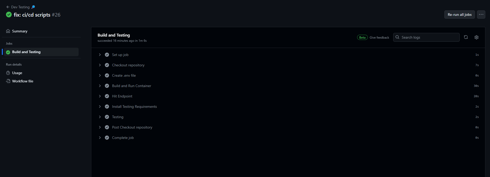
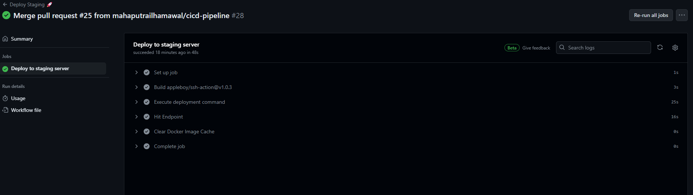
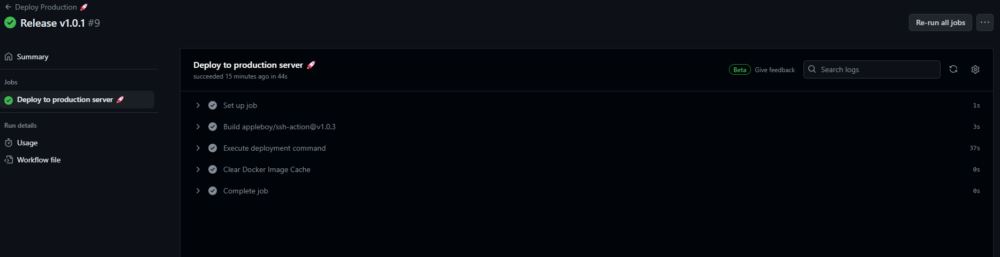
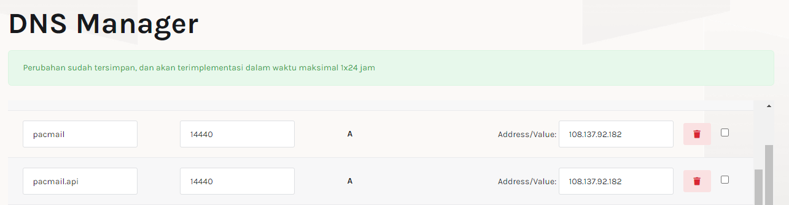
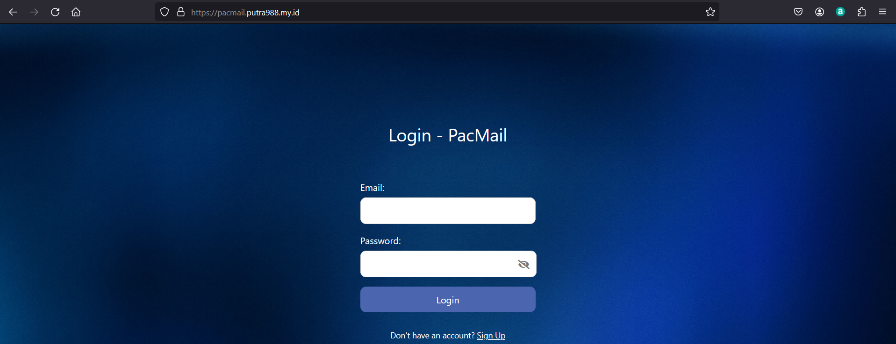

## <div> PacMail App Deployment </div>

This document contains an outline of the deployment process of the PacMail application using Flask, React.js and Docker. This project is part of the final project of pacmann's DevOps Fundamentals course.

## <div> Tools </div>

In this project there are several tools used, including: 

1. Docker.
2. GitHub Action.
3. Amazon EC2 Instance.
4. DNS Server.

## <div> Proses Pengerjaan</div>

There are five stages that need to be done to deploy an application to the server and make it accessible.

1. Server Preparation.
2. Compose the App.
3. Create CI/CD Pipeline.
4. Configure web server using Nginx.
5. Create domain name.

## <div> Workflows </div>

### 1. Server Preparation.

In this project, I am using the Ubuntu Operating System running on an __EC2 Instance__ of Amazon Web Services. The instance specifications used are t3.small (2 vCPU, 2 GiB Memory) with a root volume of 8 Gb. There are several stages in preparing the server to be used:

#### Updating the server

```bash
sudo apt update && sudo apt upgrade
```
#### Install Docker

```bash
# Add Docker's official GPG key:
sudo apt-get update
sudo apt-get install ca-certificates curl gnupg
sudo install -m 0755 -d /etc/apt/keyrings
curl -fsSL https://download.docker.com/linux/ubuntu/gpg | sudo gpg --dearmor -o /etc/apt/keyrings/docker.gpg
sudo chmod a+r /etc/apt/keyrings/docker.gpg

# Add the repository to Apt sources:
echo \
  "deb [arch=$(dpkg --print-architecture) signed-by=/etc/apt/keyrings/docker.gpg] https://download.docker.com/linux/ubuntu \
  $(. /etc/os-release && echo "$VERSION_CODENAME") stable" | \
  sudo tee /etc/apt/sources.list.d/docker.list > /dev/null
sudo apt-get update

# Install the Docker packages:
sudo apt-get install docker-ce docker-ce-cli containerd.io docker-buildx-plugin docker-compose-plugin
```

Source: [Docker documentation](https://docs.docker.com/engine/install/ubuntu/)

#### Install Nginx

```bash
sudo apt install nginx -y
```

#### Firewall Configuration

After installing __NGINX__, configure the firewall by setting which ports will be used. We can configure the firewall on the __Security Groups__ used by our server.



## 2. Compose the App

Next we need to create a configuration so that our application can run in the container we are using.

### Create Custom Docker Image

We need to create a __Dockerfile__ so that the application can run inside a Docker Container.

```dockerfile
FROM python:3.10

WORKDIR /backend

COPY . .

RUN pip install -r requirements.txt

EXPOSE 5000

CMD [ "python", "api.py" ]
```
### Create Docker Compose

Next, we need to create __docker compose__ to make it easier for us to configure the services that will be run.

```yaml
version: "3.8"

services:
  my-frontend-prod:
    image: node:latest
    container_name: my-frontend-prod
    restart: always
    depends_on:
      - my-backend-prod
      - my-database
    volumes:
      - ./frontend:/frontend
    working_dir: /frontend
    command: ["npm", "start"]
    network_mode: host

  my-backend-prod:
    image: ${APP_IMAGE}:${APP_TAG}
    container_name: my-backend-prod
    restart: always
    depends_on:
      - my-database
    volumes:
      - ./backend:/backend
    network_mode: host

  my-frontend:
    image: node:latest
    container_name: my-frontend
    restart: always
    depends_on:
      - my-backend
      - my-database
    volumes:
      - ./frontend:/frontend
    working_dir: /frontend
    command: ["npm", "start"]
    network_mode: host

  my-backend:
    build:
      context: ./backend
      dockerfile: Dockerfile
    container_name: my-backend
    restart: always
    depends_on:
      - my-database
    volumes:
      - ./backend:/backend
    network_mode: host

  my-database:
    image: postgres:13
    container_name: my-database
    hostname: database
    restart: always
    env_file:
      - .env
    volumes:
      - postgres_data:/var/lib/postgresql/data
    network_mode: host

volumes:
  postgres_data:
```

## 3. Create CI/CD Pipeline

After we have prepared the server that will be used to deploy the application, the next step we will create a CI/CD Pipeline using GitHub Actions to automate.

### 3.1 Preparation

First, we need to protect the `main` branch of our repository. This is done so that the merge process can be carried out if a pull request has been approved by the collaborator. Then we can create a CI/CD Pipeline inside the `.github/workflows` directory. In this directory there is a .yaml file that will be used to run the CI/CD process.



### Continuous Integration

The CI process will be run if there is a pull request to the `main` branch. In this process, testing is also carried out to check whether the application being developed is as desired.



### Continuous Delivery and Deployment

#### Staging

This process will be carried out if the main branch is pushed/updated where later the application will be deployed to the staging server. This process is also useful if a QA team wants to try testing the application to be developed before deploying it in production.



#### Push to registry

After the testing process on the staging server is complete and the application is declared ready to be released, the next step is to save the docker image used in the docker registry. In this project I use Docker Hub to store the docker images used. This process will be executed if there is a new tag saved on the `main` branch.


#### Production

This process will be carried out if a tag is released so that the application will be deployed to the production server. This application on the production server will later be used by the user.



## 4. Configuring Web Server using NGINX

In this process we need to configure __NGINX__ which acts as a Reverse Proxy which will direct requests from port 80 (HTTP) to the application running on the server

### Removing the default configuration

First we need to remove the default NGINX configuration.

```bash
sudo rm /etc/nginx/sites-available/default
sudo rm /etc/nginx/sites-enabled/default
```

### Creating new configuration

After we delete the default configuration from NGINX, then we will create the configuration that we will use.

```bash
cd /etc/nginx/sites-available
sudo nano pacmail.putra988.my.id
```

In the configuration file, we will specify which ports NGINX listens on and the destination port to which requests will be redirected.

```nginx
server {
    listen 80;
    server_name pacmail.putra988.my.id;

    location / {
        proxy_pass http://:public-ip:3000;
    }
}

server {
    listen 80;
    server_name pacmail.api.putra988.my.id;

    location / {
        proxy_pass http://public-ip:5000;
    }
}
```

After successfully creating the configuration file, then we activate the configuration file by creating a symlink to the `sites-enabled` directory.

```bash
sudo ln -s /etc/nginx/sites-available/pacmail.putra988.my.id /etc/nginx/sites-enabled
```

Next, check the syntax and test to ensure there are no incorrect configurations.

```bash
sudo nginx -t
```
If there are no errors, now the application can be accessed directly without needing to specify a port.

## 5. Create Domain Name and Install SSL Certificate

The final process of this project is creating a domain name to make it easier for users to access the application without needing to remember and write the public IP used by the application. This process will also show how to install an SSL certificate to ensure the connection used is secure via HTTPS. In this project, I used [jagoanhosting.com](jagoanhosting.com) to generate the domain name and __Certbot__ to generate the SSL certificate.

### Create DNS Record



### Instal SSL Certificate

After we create a domain name, next we need to generate an SSL certificate and install the certificate on the server used. Before generating SSL, we need to install __Certbot__ first.

```bash
sudo apt install certbot python3-certbot-nginx
```

Then, using the NGINX configuration file that has been created, we will generate an SSL certificate using __Certbot__.

```bash
sudo certbot --nginx -d "pacmail.putra988.my.id"
```

After we have generated and installed the SSL certificate, now the connection is secure using HTTPS. You can access the application using [pacmail.putra988.my.id](pacmail.putra988.my.id)



## Conclusion

In this project the deployment process has been successfully carried out. Overall, both the server setup process and the application deployment process to the server were successfully carried out and the application can be accessed via the domain used with an HTTPS connection. The next plans for this project are adding an email reply feature and carrying out stress testing.