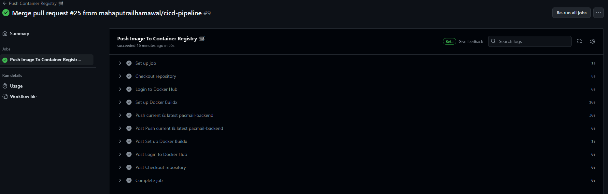

## <div> PacMail App Deployment </div>

This document contains an outline of the deployment process of the PacMail application using Flask, React.js and Docker. This project is part of the final project of pacmann's DevOps Fundamentals course.

## <div> Tools </div>

In this project there are several tools used, including: 

1. Docker.
2. GitHub Action.
3. Amazon EC2 Instance.
4. DNS Server.

## <div> Proses Pengerjaan</div>

There are five stages that need to be done to deploy an application to the server and make it accessible.

1. Server Preparation.
2. Compose the App.
3. Create CI/CD Pipeline.
4. Configure web server using Nginx.
5. Create domain name.

## <div> Workflows </div>

### 1. Server Preparation.

In this project, I am using the Ubuntu Operating System running on an __EC2 Instance__ of Amazon Web Services. The instance specifications used are t3.small (2 vCPU, 2 GiB Memory) with a root volume of 8 Gb. There are several stages in preparing the server to be used:

#### 1.1 Updating the server

```bash
sudo apt update && sudo apt upgrade
```
#### 1.2 Install Docker

```bash
# Add Docker's official GPG key:
sudo apt-get update
sudo apt-get install ca-certificates curl gnupg
sudo install -m 0755 -d /etc/apt/keyrings
curl -fsSL https://download.docker.com/linux/ubuntu/gpg | sudo gpg --dearmor -o /etc/apt/keyrings/docker.gpg
sudo chmod a+r /etc/apt/keyrings/docker.gpg

# Add the repository to Apt sources:
echo \
  "deb [arch=$(dpkg --print-architecture) signed-by=/etc/apt/keyrings/docker.gpg] https://download.docker.com/linux/ubuntu \
  $(. /etc/os-release && echo "$VERSION_CODENAME") stable" | \
  sudo tee /etc/apt/sources.list.d/docker.list > /dev/null
sudo apt-get update

# Install the Docker packages:
sudo apt-get install docker-ce docker-ce-cli containerd.io docker-buildx-plugin docker-compose-plugin
```

Source: [Docker documentation](https://docs.docker.com/engine/install/ubuntu/)

#### 1.3 Install Nginx

```bash
sudo apt install nginx -y
```

#### Firewall Configuration

After installing __NGINX__, configure the firewall by setting which ports will be used. We can configure the firewall on the __Security Groups__ used by our server.


## 2. Compose the App

Next we need to create a configuration so that our application can run in the container we are using.

### 1. Create Custom Docker Image

We need to create a __Dockerfile__ so that the application can run inside a Docker Container.

```dockerfile
FROM python:3.10

WORKDIR /backend

COPY . .

RUN pip install -r requirements.txt

EXPOSE 5000

CMD [ "python", "api.py" ]
```
### 2. Create Docker Compose

Next, we need to create __docker compose__ to make it easier for us to configure the services that will be run.

```yaml
version: "3.8"

services:
  my-frontend-prod:
    image: node:latest
    container_name: my-frontend-prod
    restart: always
    depends_on:
      - my-backend-prod
      - my-database
    volumes:
      - ./frontend:/frontend
    working_dir: /frontend
    command: ["npm", "start"]
    network_mode: host

  my-backend-prod:
    image: ${APP_IMAGE}:${APP_TAG}
    container_name: my-backend-prod
    restart: always
    depends_on:
      - my-database
    volumes:
      - ./backend:/backend
    network_mode: host

  my-frontend:
    image: node:latest
    container_name: my-frontend
    restart: always
    depends_on:
      - my-backend
      - my-database
    volumes:
      - ./frontend:/frontend
    working_dir: /frontend
    command: ["npm", "start"]
    network_mode: host

  my-backend:
    build:
      context: ./backend
      dockerfile: Dockerfile
    container_name: my-backend
    restart: always
    depends_on:
      - my-database
    volumes:
      - ./backend:/backend
    network_mode: host

  my-database:
    image: postgres:13
    container_name: my-database
    hostname: database
    restart: always
    env_file:
      - .env
    volumes:
      - postgres_data:/var/lib/postgresql/data
    network_mode: host

volumes:
  postgres_data:
```

## 3. Create CI/CD Pipeline

After we have prepared the server that will be used to deploy the application, the next step we will create a CI/CD Pipeline using GitHub Actions to automate.

### 1. Preparation

Yang pertama, kita perlu melindungi `main` branch dari repositori kita. Hal tersebut dilakukan agar proses merge dapat dijalankan jika sebuah pull request sudah disetujui dari collaborator. Kemudian kita bisa membuat CI/CD Pipeline di dalam `.github/workflows` direktori. Di dalam direktori tersebut terdapat file .yaml yang akan digunakan menjalankan proses CI/CD.


### Continuous Integration

Proses CI akan dijalankan jika ada pull request ke `main` branch. Pada proses ini juga dilakukan testing guna mengecek apakah aplikasi yang dikembangkan sesuai yang diinginkan.


### Continuous Delivery and Deployment

#### Staging

Proses ini akan dijalankan jika `main` branch didorong/diperbarui dimana nanti aplikasi akan di deploy ke server staging. Pada proses ini juga berguna jika ada tim QA ingin mencoba menguji aplikasi yang akan dikembangkan sebelum di deploy di production.


#### Push to registry

Setelah proses pengujian di server staging selesai dan aplikasi dinyatakan siap di release, langkah selanjutnya yaitu menyimpan docker image yang digunakan ke dalam docker registry. Pada proyek ini saya menggunakan __Docker Hub__ untuk menyimpan docker image yang digunakan. Proses ini akan dijalankan jika ada tag baru yang disimpan pada `main` branch.



#### Production

Proses ini akan dijalankan jika ada tag yang di release sehingga aplikasi akan di deploy ke server production. Aplikasi di dalam server production inilah yang nantinya akan digunakan oleh user.


## 4. Configuring Web Server using NGINX

Pada proses ini kita perlu melakukan konfigurasi NGINX yang bertindak sebagai Reverse Proxy dimana akan mengarahkan request dari port 80 (HTTP) ke aplikasi yang berjalan di server

### Removing the default configuration

Pertama kita perlu menghapus konfigurasi default NGINX.

```bash
sudo rm /etc/nginx/sites-available/default
sudo rm /etc/nginx/sites-enabled/default
```

### Creating new configuration

Setelah kita menghapus konfigurasi default dari NGINX, kemudian kita akan membuat konfigurasi yang akan kita gunakan.

```bash
cd /etc/nginx/sites-available
sudo nano pacmail.putra988.my.id
```

Di dalam file konfigurasi, kita akan menentukan port mana saja yang didengarkan NGINX dan port tujuan ke mana permintaan akan dialihkan.

```nginx
server {
    listen 80;
    server_name pacmail.putra988.my.id;

    location / {
        proxy_pass http://:public-ip:3000;
    }
}

server {
    listen 80;
    server_name pacmail.api.putra988.my.id;

    location / {
        proxy_pass http://public-ip:5000;
    }
}
```

Setelah berhasil membuat file konfigurasi, kemudian kita aktifkan file konfigurasi tersebut dengan membuat symlink ke direktori `sites-enabled`.

```bash
sudo ln -s /etc/nginx/sites-available/pacmail.putra988.my.id /etc/nginx/sites-enabled
```

Selanjutnya lakukan pengecekan syntax dan testing untuk memastikan tidak ada konfigurasi yang salah.

```bash
sudo nginx -t
```
Jika tidak ada error, sekarang aplikasi dapat diakses secara langsung tanpa perlu menentukan port.

## 5. Create Domain Name and Install SSL Certificate

Proses terakhir dari proyek ini yaitu membuat sebuah nama domain untuk memudahkan user dalam mengakses aplikasi tanpa perlu mengingat dan menulis ip publik yang digunakan oleh aplikasi. Pada proses ini juga akan ditunjukkan bagaimana cara install sebuah Sertifikat SSL untuk memastikan koneksi yang digunakan aman via HTTPS. Pada proyek ini, saya menggunakan [jagoanhosting.com](jagoanhosting.com) untuk membuat nama domain dan __Certbot__ untuk generate sertifikat SSL.

### 1. Create DNS Record


### 2. Instal SSL Certificate

Setelah kita membuat nama domain, selanjutnya kita perlu generate sertifikat SSL dan menginstal sertifikat tersebut ke dalam server yang digunakan. Sebelum melakukan generate SSL, kita perlu install __Certbot__ terlebih dahulu.

```bash
sudo apt install certbot python3-certbot-nginx
```

Kemudian dengan menggunakan file konfigurasi NGINX yang sudah dibuat, kita akan mengenerate sertifikat SSL dengan menggunakan __Certbot__.

```bash
sudo certbot --nginx -d "pacmail.putra988.my.id"
```

Setelah kita sudah mengenerate dan instal sertifikat SSL, sekarang koneksi sudah aman dengan menggunakan HTTPS. Anda bisa akses aplikasi tersebut melalui [pacmail.putra988.my.id](pacmail.putra988.my.id)


## Kesimpulan

Pada proyek ini proses deployment telah berhasil dikerjakan. Secara keseluruhan baik proses setup server sampai proses deployment aplikasi ke sever berhasil dikerjakan dan aplikasi dapat diakses via domain yang digunakan dengan koneksi HTTPS. Untuk rencana selanjutnya dari proyek ini yaitu menambahkan fitur reply email dan  melakukan stress testing.